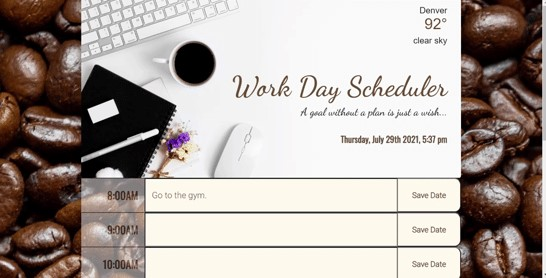

__<h1 style="color:blue"> Work Day Scheduler</h1>__ 

## __
Description
__
Workday Scheduler is a calendar application that allows a user to save per the hour their daily tasks and events for the day. I created the app with HTML, CSS and JavaScript powered by jQuery.  In the header I utilized an API [Open Weather Map](https://openweathermap.org/api) to have real time weather updates for the user to plan for their day accordingly. The [Moment.js](https://momentjs.com/) library was used to update the date and time shown on the banner. The time blocks are responsive to the current time, if the hour has passed it will show beige, the current hour will be pale gray, and future hours will be in tan color.  The scheduler was built to allow the user to type a comment in the assigned time block, save and refer back to at a later time. The events are saved in local storage in the browser which are retrievedback onto the page allowing the data to remain even after refreshing the page.  The content can be deleted and saved for continuous use. With all of life’s demands an application like the Workday Scheduler will help keep you well organized!

 
 

## __
 Final Project
__

 
 

 
## Links:
Deployed Application: [Work Day Challenge](https://sheylapopovich.github.io/work-day-scheduler/)
  Contributions, issues, and feature requests are welcome!
Give a ⭐️ if you like this project!

 

### This site was built using GitHub Pages.

 

  
